# Matplotlib Visualization

Matplotlib is an amazing visualization library in Python for 2D plots of arrays. Matplotlib is a multi-platform data visualization library built on NumPy arrays and designed to work with the broader SciPy stack.

- In `matplotlib`, everything is organized in a hierarchy.
- At the top level, it consists of `matplotlib.pyplot` module.
- `pyplot` is used only for few activities such as figure creation.
- Through the created figures, one or more axes/subplot objects are created.
- The axes objects are further used for doing many plotting actions.

### A. Installing Matplotlib
- Matplotlib is a **third-party library** and is <u>not a part of standard Python library</u>.

- Matplotlib can easily be installed using `pip` utility command

  ```python
  pip install matplotlib
  ```

- Matplotlib is directly available in distributions such as `Anaconda` and `WinPython`


-----

### B. Loading Matplotlib

- To use `matplotlib` in python, it must be imported first using the `import` command

  ```python
  import matplotlib
  ```

- To check the **version** of the installed matplotlib, following command can be used 

  ```python
  print(matplotlib.__version__)
  ```

- To **upgrade** the already installed matplotlib. following `--upgrade` keyword can be used with `pip install`
```python
pip install --upgrade matplotlib
```
  


-------

### C. Figure Anatomy

Essential parts of `matplotlib` figure are:

- `Figure`: Whole area chosen for plotting.
- `Axes`: Area where data is plotted.
- `Axis`: Number-line like objects which define graph limits.
- `Artist`: Every element on the figure is an artist.


##### Creating A Figure

> Figure refers to the whole area or page on which everything is drawn. It <u>includes Axis, Axes and Artist</u> elements.

A figure is created using the `figure` method of `pyplot` module.

|Parameter	| Objective |
|-----------|-----------|
|Figsize	| (width,height) tuple in inches |
|DpiDots	| per inches |
|Facecolor	| Figure patch facecolor |
|Edgecolor	| Figure patch edge color |
|Linewidth	| Edge line width |


```python
# All the packages used in this tutorial will be imported here:
import matplotlib.pyplot as plt
import numpy as np

# this is for creating inline charts in matplotlib
%matplotlib inline
```


```python
fig = plt.figure()
```


    <Figure size 432x288 with 0 Axes>


Executing the above code won't display any figure.

 `show` method can be used to view the created figure.


```python
fig = plt.figure()
plt.show()
```


    <Figure size 432x288 with 0 Axes>


Output is just a figure object, since it doesn't have any element thus it will be a blank figure.

##### Creating An Axes

> Axes is a region of the figure, available for plotting data.

-  An Axes object is associated with only one Figure but a Figure can contain one or more Axes elements. 

- Axes has multiple Axis depending upon the plot dimensionality, (2D or 3D)
  $$
  Axis ∝ Dimensions
  $$
  
 An axis can be created using `add_subplot` method

*Syntax:*
```python
add_subplot(nrows, ncols, index)
```

 When nrows, ncols and index, all three,  are less than 10, then no need for comma separation. Thus `add_subplot(1, 1, 1`) = `add_subplot(111)` .
 
 *Example:*


```python
fig = plt.figure()
ax = fig.add_subplot(1,1,1)
plt.show
```


    <function matplotlib.pyplot.show(close=None, block=None)>


`add_subplot` adds plot inside the main plot. `subplot` adds plot outside the main plot usin row and col in figure grid.


```python
fig, ax = plt.subplots(nrows=1, ncols=1)
plt.show
```


    <function matplotlib.pyplot.show(close=None, block=None)>


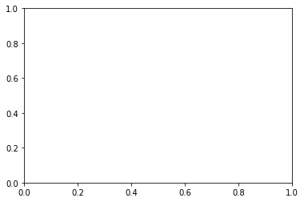


##### Adjusting Figure Size

- `width` and `height` of the figure cam be adjusted using `figsize(width, height)` argument in `figure` method.
- Default <u>width and height</u> of the figure are <u>6 and 4 inches respectively</u>.

*Example:*


```python
fig, ax = plt.subplots(nrows=1, ncols=1, figsize=(8,6))
plt.show()
```


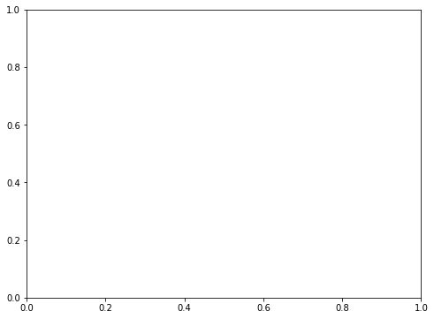


##### Setting Title And Axis Labels

`set` method can be used on created Axes to set various params such as `xlabel`, `ylabel`, `xlim`, `ylim` and `title`.

*Example:*


```python
fig, ax= plt.subplots(nrows=1, ncols=1, figsize=(6, 4))
ax.set(title="My First Plot",
      xlabel="X-Axis", ylabel="Y-Axis",
      xlim=(0,5), ylim=(0,10))
plt.show()
```


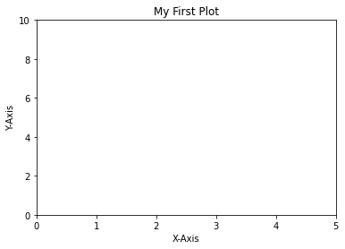


- Setting an attribute can also be done with functions of the form `set_<parameter_name>`, as shown in below code.

*Example:*


```python
fig, ax= plt.subplots(nrows=1, ncols=1, figsize=(6, 4))
ax.set_title("My First Plot")
ax.set_xlabel("X-Axis"); ax.set_ylabel("Y-Axis")
ax.set_xlim(0,5); ax.set_ylim(0,10)
plt.show()
```


* Output using `set()`  or `set_<param_name>()` method will be same.  

##### Plotting Data

- Data can be plotted using the `plot` function. There are numerous other plot functions for plotting various chart types.
- plot function is called on the created axes object

*Example:*


```python
x = [1, 2, 3, 4]; y = [2, 4, 6, 8]
```


```python
fig, ax= plt.subplots(nrows=1, ncols=1, figsize=(6, 4))
ax.set_title("My First Plot")
ax.set_xlabel("X-Axis"); ax.set_ylabel("Y-Axis")
ax.set_xlim(0,5); ax.set_ylim(0,10)
ax.plot(x,y)	# this maps values of x on X-Axis and for y on Y-Axis
plt.show()
```


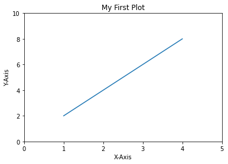


**Note:** Plotting data or setting attributes can also be done by calling functions like `plot`, and `title` directly on `plt`. This would plot the data on axes, which is active currently.

> However, `Explicit is better than implicit`.

*Example:*


```python
fig = plt.figure(figsize=(6,4))
plt.title('Plottig Data & Attr on plt')
plt.xlabel('X-Axis'); plt.ylabel('Y-Axis')
plt.xlim(0,5); plt.ylim(0,10)
plt.plot(x, y)
plt.show()
```


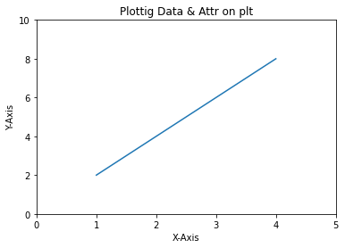


##### Adding A Legend

- `legend` function is called on created Axes object to product a legend
- Legend used `label` argument provided to line drawn using `plot`

*Example:*


```python
fig = plt.figure(figsize=(6,4))
ax = fig.add_subplot(111)
ax.set(title="My First Plot",
       xlabel="X-Axis", ylabel="Y-Axis",
       xlim=(0,5), ylim=(0,10))
plt.plot(x,y, label="linear-growth")  # add legend to the figure
plt.legend()  # shows legend in the figure
plt.show()
```


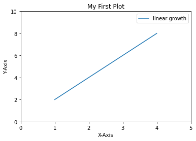


------- 

### D. Types Of Plots

Most basic and frequently used types of plots: `Line Plot`, `Scatter Plot` , `Bar Plot`, `Pie Plot`, `Histogram` and `Box Plot`.

##### D1. Line Plot

Line plot is used to:

- visualize a trend in data.
- compare two variables.

> `plot` function is used for plotting a line plot.

*Syntax:*

```python
plot(x, y)
# 'x' , 'y' : Data values representing two variables.
```

*Example:*


```python
days = [1, 5, 8, 12, 15, 19, 22, 26, 29]
temp = [29.3, 30.1, 30.4, 31.5, 32.3, 32.6, 31.8, 32.4, 32.7]
```


```python
fig, ax= plt.subplots(nrows=1, ncols=1, figsize=(6, 4))

ax.set(title="Avg Daily Temp in Jan 2018",
      xlabel="Days", ylabel="Temp (Degree)",
      xlim=(0,30), ylim=(25,35))

ax.plot(days, temp) 	# can also be plotted using plt.plot(days, temp)

plt.show()
```


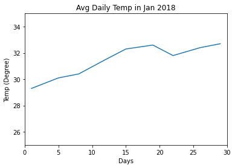


`plot` function has following params which are most frequently used:

- `color`: Sets the <u>color of the line</u>.
- `linestyle`: Sets the line style, e.g., solid, dashed, etc.
- `linewidth`: Sets the thickness of a line.
- `marker`: Chooses a marker for data points, e.g., circle, triangle, etc.
- `markersize`: Sets the size of the chosen marker.
- `markerfacecolor` or `mfc`: Set the color of marker face.
- `markeredgecolor` or `mec`: Set the color of marker edge.
- `markeredgewidth` or `mew`: Set the thickness of marker edge.
- `label`: Names the line, which will come in <u>legend</u>.

Set of different [linestyle](https://matplotlib.org/3.1.0/gallery/lines_bars_and_markers/linestyles.html) and [marker](https://matplotlib.org/api/markers_api.html) for `plot` function.

*Line plot with green dashed (--) `linestyle` and `linewidth`  of 3:*


```python
fig, ax= plt.subplots(nrows=1, ncols=1, figsize=(6, 4))

ax.set(title="Avg Daily Temp in Jan 2018",
      xlabel="Days", ylabel="Temp (Degree)",
      xlim=(0,30), ylim=(25,35))

ax.plot(days, temp, color="green", linestyle="--", linewidth=3)

plt.show()
```


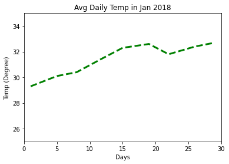


*Line plot with grey circle marker (o) and white marker edge color:*


```python
fig, ax= plt.subplots(nrows=1, ncols=1, figsize=(6, 4))

ax.set(title="Avg Daily Temp in Jan 2018",
      xlabel="Days", ylabel="Temp (Degree)",
      xlim=(0,30), ylim=(25,35))

ax.plot(days, temp, color="green", 
        marker="o", markersize=10, 
        mfc="grey", mec="white", mew=5)

plt.show()
```


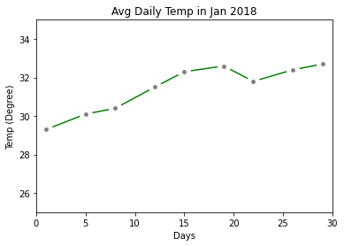


Using `plot` function multiple times is one of the ways to draw multiple lines.

*Example:*


```python
days = [1, 5, 8, 12, 15, 19, 22, 26, 29]
location1_temp = [29.3, 30.1, 30.4, 31.5, 32.3, 32.6, 31.8, 32.4, 32.7]
location2_temp = [26.4, 26.8, 26.1, 26.4, 27.5, 27.3, 26.9, 26.8, 27.0]
```


```python
fig, ax= plt.subplots(nrows=1, ncols=1, figsize=(6, 4))

ax.set(title="Avg Daily Temp in Jan 2018",
      xlabel="Days", ylabel="Temp (Degree)",
      xlim=(0,30), ylim=(25,35))

ax.plot(days, location1_temp, color="green")
ax.plot(days, location2_temp, color="orange")

plt.show()
```


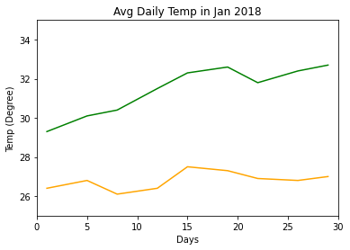


##### D2. Scatter Plot

- `Scatter Plot` is used for showing how one variable is related with another.
- `Scatter Plot` consists of data points. If the spread of data points is linear, then two variables are highly correlated.
- `scatter` function is used for drawing scatter plots.

*Syntax:*

```python
scatter(x, y)
# 'x', 'y' : Data values representing two variables.
```

*Example:*


```python
fig, ax= plt.subplots(nrows=1, ncols=1, figsize=(6, 4))

ax.set(title="Avg Daily Temp in Jan 2018",
      xlabel="Days", ylabel="Temp (Degree)",
      xlim=(0,30), ylim=(25,35))

ax.scatter(days, temp, color="green")

plt.show()
```


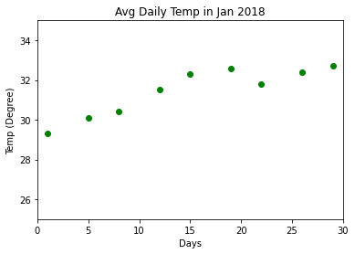


Following are the most common params for scatter plot:

- `color` or  `c`: Sets color of markers.
- `s`: Sets size of markers.
- `marker`: Selects a marker. e.g: circle, triangle, etc
- `edgecolor`: Sets the color of lines on edges of markers.
- `alpha`: Set the opaqueness of the markers, between 0 and 1. 

*Scatter plot with marker color "orange" and size 200 with edge color "black"*


```python
fig, ax= plt.subplots(nrows=1, ncols=1, figsize=(6, 4))

ax.set(title="Avg Daily Temp in Jan 2018",
      xlabel="Days", ylabel="Temp (Degree)",
      xlim=(0,30), ylim=(25,35))

ax.scatter(days, temp, color=["orange"], 
           marker="o", s=[200], edgecolor="black")  # c and s can take a list of values

plt.show()
```


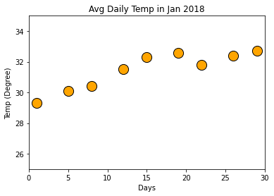


**NOTE:** `plot` function can also create a scatter plot when `linestyle` is set to `none`, and a `marker` is chosen, as shown in below code.

##### D3. Bar Plot

`Bar Plot` is commonly used for:
- comparing two or more categories.
- comparing categories over a short period of time.

`bar` and `barh` are used for plotting vertical and horizontal bar plots respectively. These function returns a Matplotlib container object with all bars.

*Syntax:*

```python
bar(x,width)
# 'x' : x coordinates of bars.
# 'width' : List of width

barh(y, height)
# 'y' : y coordinates of bars
# 'height' : List of heights of each bar. 
```

*Example:*


```python
quarters = [1, 2, 3]
sales_2017 = [25782, 35783, 36133]
```


```python
fig, ax= plt.subplots(nrows=1, ncols=1, figsize=(6, 4))

ax.set(title='Avg. Quarterly Sales',
      xlabel='Quarter', ylabel='Sales (in millions)')

ax.bar(quarters, sales_2017)

ax.set_xticks(quarters)
ax.set_xticklabels(['Q1-2017', 'Q2-2017', 'Q3-2017'])

plt.show()
```


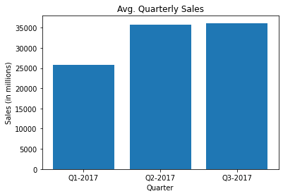


Common Parameters of 'bar':
- `color`: Sets the color of bars.
- `edgecolor`: Sets the color of the border line of bars.
- `width`: Sets the width of bars
- `align`: Aligns the bars w.r.t x-coordinates
- `label`: Sets label to a bar, appearing in legend.

Using parameters to modify color and width of bars:


```python
fig, ax= plt.subplots(nrows=1, ncols=1, figsize=(6, 4))

ax.set(title="Avg Quarterly Sales",
       xlabel="Quarter", ylabel="Sales (Million)")

ax.bar(quarters, sales_2017, color="#6c3376", edgecolor="grey", width=0.5)

ax.set_xticks(quarters)
ax.set_xticklabels(["Q1-2017","Q2-2017","Q3-2017"])

plt.show()
```


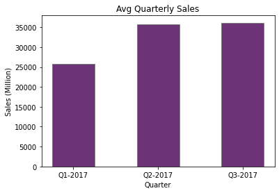


**Multiple Bar Chart**

*Example:*


```python
# create data for plotting
quarters = [1, 2, 3]
sales_2016 = [28831, 30762, 32178]; sales_2017 = [25782, 35783, 36133];
sales_2018 = [35783, 32178, 30762]
```


```python
# set the width of the bar
barwidth = 0.25

# set the position of bars on x-axis, remember to import numpy library
r1 = np.arange(len(quarters)) 
r2 = [x + barwidth for x in r1]
r3 = [x + barwidth for x in r2]

# set the potision of x-axis ticks
xtick_list = [r + barwidth for r in range(len(quarters))]

# create a list of x-axis ticks label
xticklabels_list = ["Q1", "Q2", "Q3"]
```


```python
# plot multiple bars
fig, ax= plt.subplots(nrows=1, ncols=1, figsize=(6, 4))

ax.set(title='Avg. Quarterly Sales',
      xlabel='Quarter', ylabel='Sales (in millions)')

ax.bar(r1, sales_2016, color="green", width=barwidth, label="2016")
ax.bar(r2, sales_2017, color="#6c3376", width=barwidth, label="2017")
ax.bar(r3, sales_2018, color="#f3e151", width=barwidth, label="2018")

ax.set_xticks(xtick_list)
ax.set_xticklabels(xticklabels_list)
ax.legend(loc="lower center", bbox_to_anchor=(0.5, -0.3), borderaxespad=0,  frameon=False, ncol=3)

plt.show()
```


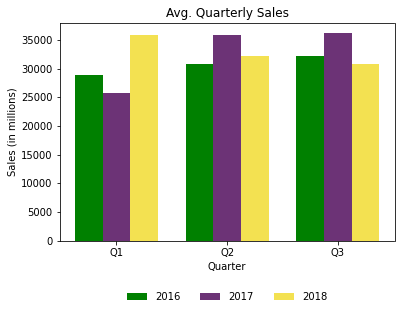


Some common parameter for `legend` method:
- `title` : The legend's title. Default is no title (None).
- `title_fontsize` : The fontsize of the legend's title.
- `loc` : The location of the legend. Str or pair of float.
- `bbox_to_anchor` : Box that is used to position the legend in conjunction with loc. It takes horizontal and vertical position as float.
- `ncol` : The number of columns that the legend has. Default is 1.
- `fontsize` : Controls the font size of the legend. Only used if prop is not specified.
- `frameon` : Control whether the legend should be drawn on a patch (frame). Default is True.
- `framealpha` : Control the alpha transparency of the legend's background.
- `shadow` : Control whether to draw a shadow behind the legend. IF activated then `framealpha` is None.
- `facecolor ` : Control the legend's background color. Default is white.
- `borderpad` : The fractional whitespace inside the legend border.
- `borderaxespad` : The pad between the axes and legend border.
- `labelspacing` : The vertical space between the legend entries.

**Horizontal Bar Chart**

- `barh` draws the bars horizontally as shown in above image. 
- `height` parameter is used to adjust the height of each bar.

*Example:*


```python
fig, ax= plt.subplots(nrows=1, ncols=1, figsize=(6, 4))

ax.set(title="Avg Quarterly Sales",
       xlabel="Sales (Million)", ylabel="Quarter")

ax.barh(quarters, sales_2017, color="#6c3376", edgecolor="grey", height=0.5)

ax.set_yticks(quarters)
ax.set_yticklabels(["Q1-2017","Q2-2017","Q3-2017"])

plt.show()
```


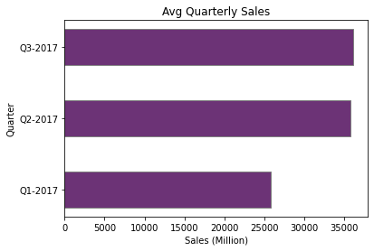


To reverse the order of Y-axis, `gca()` along with `invert_yaxis()` can be used with `plt`:

*Example:*


```python
fig, ax= plt.subplots(nrows=1, ncols=1, figsize=(6, 4))

ax.set(title="Avg Quarterly Sales",
       xlabel="Sales (Million)", ylabel="Quarter")

ax.barh(quarters, sales_2017, color="#6c3376", edgecolor="grey", height=0.5)

ax.set_yticks(quarters)
ax.set_yticklabels(["Q1-2017","Q2-2017","Q3-2017"])
plt.gca().invert_yaxis()

plt.show()
```


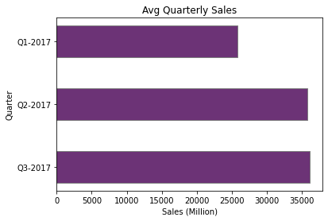


**Stacked Bar Chart**

Horizontal and Vertical stack bar chart can be created by using `left` and `bottom` respectively.

`Numpy arrays` as well as `list comprehension` can be used to calculate `bottom/left` 

*Vertical Stacked Bar Chart:*

Using Numpy Array:


```python
sbar_width = 0.8

fig, ax= plt.subplots(nrows=1, ncols=1, figsize=(6, 4))

ax.set(title='Avg. Quarterly Sales',
      xlabel='Quarter', ylabel='Sales (in millions)')

ax.bar(quarters, sales_2016, color="green", width=sbar_width, label="2016")
ax.bar(quarters, sales_2017, bottom=sales_2016,                             # bottom for sales_2017 = height of sales_2016
       color="#6c3376", width=sbar_width, label="2017") 
ax.bar(quarters, sales_2018, bottom=list(np.add(sales_2017, sales_2016)),   # bottom of sales_2018 = height of sales_2017 + height of sales_2016
       color="#f3e151", width=sbar_width, label="2018") 

ax.set_xticks(quarters)
ax.set_xticklabels(xticklabels_list)
ax.legend(loc="center right", bbox_to_anchor=(1.2, 0.5), borderaxespad=0,  frameon=False, ncol=1)

plt.show()
```


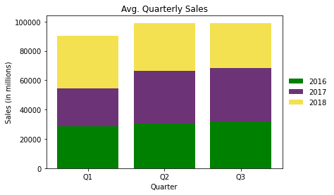


Using list comprehension:


```python
sbar_width = 0.8

fig, ax= plt.subplots(nrows=1, ncols=1, figsize=(6, 4))

ax.set(title='Avg. Quarterly Sales',
      xlabel='Quarter', ylabel='Sales (in millions)')

ax.bar(quarters, sales_2016, color="green", width=sbar_width, label="2016")
ax.bar(quarters, sales_2017, bottom=sales_2016,
       color="#6c3376", width=sbar_width, label="2017")
# using list comprehension for adding two or more datasets to bottom param as list
ax.bar(quarters, sales_2018, bottom=[sum(x) for x in zip(sales_2017, sales_2016)], 
       color="#f3e151", width=sbar_width, label="2018")

ax.set_xticks(quarters)
ax.set_xticklabels(xticklabels_list)
ax.legend(loc="center right", bbox_to_anchor=(1.2, 0.5), borderaxespad=0,  frameon=False, ncol=1)

plt.show()
```


*Horizontal Stacked Bar Chart:*


```python
fig, ax= plt.subplots(nrows=1, ncols=1, figsize=(6, 4))

ax.set(title='Avg. Quarterly Sales',
      xlabel='Sales (in millions)', ylabel='Quarter')

ax.barh(quarters, sales_2016, color="green", height=sbar_width, label="2016")
ax.barh(quarters, sales_2017, left=sales_2016,                             # in barh, bottom becomes left
       color="#6c3376", height=sbar_width, label="2017") 
ax.barh(quarters, sales_2018, left=list(np.add(sales_2017, sales_2016)),
        color="#f3e151", height=sbar_width, label="2018") 

ax.set_yticks(quarters)
ax.set_yticklabels(xticklabels_list)
ax.legend(loc="center right", bbox_to_anchor=(1.2, 0.5), borderaxespad=0,  frameon=False, ncol=1)

plt.show()
```


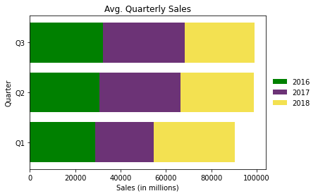


##### D4. Pie Chart

Pie chart is commonly used for:
- showing the proportion of categories.
- comparing fewer categories.

*Sntax:*

```python
pie(x)
# 'x' : sizes of portions, passed either as a fraction or a number.
```

*Example:*


```python
fig, ax= plt.subplots(nrows=1, ncols=1, figsize=(6, 4))

ax.set(title="Avg. Quarterly Sales (2017)")
ax.pie(sales_2017)

plt.show()
```


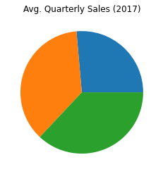


Common Parameters of `pie`:

|Parameter |Objective |
|----------|----------|
|colors| Sets the colors of portions.|
|labels| Sets the labels of portions.|
|startangle| Sets the start angle at which portion drawing starts.|
|autopct| Sets the percentage display format of an area, covering portions.|
|explode| Offset a slice. Receives a tuple reffering to each slice and percent of slice gap (0 to 1).|
|counterclock| Specify fractions direction of the pie chart. True or False (value is True by default).|
|shadow| Set shadow to whole pie chart.|

Adding label and percentage to pie chart with slice on Q1:


```python
# definig list of labels
quarters = ['Q1-2017', 'Q2-2017', 'Q3-2017']
```


```python
fig, ax= plt.subplots(nrows=1, ncols=1, figsize=(6, 4))

ax.set(title='Avg. Quarterly Sales')

ax.pie(sales_2017, labels=quarters, startangle=90, autopct='%1.1f%%', 
       counterclock=False, explode=(0.1, 0, 0), shadow=True)

plt.show()
```


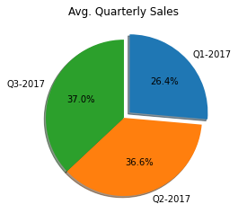


##### D5. Histogram Chart

Histogram chart is used for:
- Visualize the spread of data of a distribution.
- It is an estimate of the probability distribution of a continuous variable.

`hist` function computes and draws the histogram of x.

*Syntax:*
```python
hist(x)
# 'x' : Data values of a single variable.
```

Common params used with hist():

|Parameter |Objective |Type |
|----------|----------|-----|
|x |Array or sequence of arrays |Required |
|bins |Integer or sequence | Optional |
|range |Upper or lower range of bins | Optional |
|color |Set color of bins |Optional |
|density |If True, the first element of the return tuple will be the counts normalized to form a probability density |Optional |
|cumulative |If True, then a histogram is computed where each bin gives the counts in that bin plus all bins for smaller values |Optional |
|histtype |Type of histogram to draw bar (default), barstacked, step, stepfilled |Optional | 
| orientation| If 'horizontal', barh will be used for bar-type histograms and the bottom kwarg will be the left edges| Optioal |


*Example:*

Plotting Histogram in bar style


```python
# Generate a normal distribution, center at x=0 and y=5
hist_x = np.random.randn(1000)
hist_y = np.random.randn(1000) + hist_x *.4
```


```python
fig, axs = plt.subplots(1, 2, sharey=True, tight_layout=True, figsize=(6,4))

# We can set the number of bins with the `bins` kwarg
axs[0].hist(x)
axs[1].hist(y, bins=40, color="#6c3376")

plt.show()
```


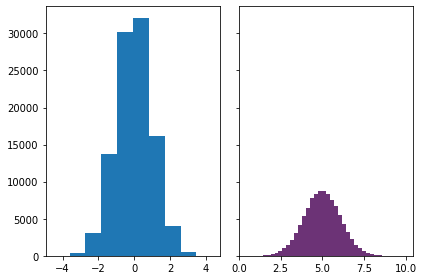


##### D6. Box Plots

Box plots are commonly used to:
- Visualize the spread of data.
- Compare distributions.
- Detect outliers.

*Syntax:*
```python
boxplot(x)
# 'x' : list of values or list of list of values.
```

|Parameter |Objective |
|----------|----------|
|labels | Sets the labels for box plots|
|notch | Sets to True if notches need to be created around the median|
|bootstrap | Number set to indicate that notches around the median are bootstrapped|
|vert | Sets to False for plotting Box plots horizontally|
|showcaps | Show the caps on the ends of whiskers|
|showbox | Show the central box |
|showfliers | Show the outliers beyond the caps|
|patch_artist | Fill teh box with color |
|positions | optional parameter accepts array and sets the position of boxes |
|widths | optional parameter accepts array and sets the width of boxes |
|meanline | optinal having boolean value try to render meanline as full width of box|

*Example:*


```python
# fake data
np.random.seed(19680801)
data = np.random.lognormal(size=(37, 4), mean=1.5, sigma=1.75)
labels = list('ABCD')
fs = 10  # fontsize
```


```python
# creating plot
fig, ax= plt.subplots(nrows=2, ncols=3, sharey=True, figsize=(6, 6))

ax[0,0].boxplot(data, labels=labels)
ax[0,0].set_title("Default", fontsize=fs)

ax[0,1].boxplot(data, labels=labels, showmeans=True)
ax[0,1].set_title("showmeans=True", fontsize=fs)

ax[0,2].boxplot(data, labels=labels, showmeans=True, meanline=True)
ax[0,2].set_title("showmeans=True,\nmeanline=True", fontsize=fs)

ax[1,0].boxplot(data, labels=labels, showbox=False, showcaps=False)
ax[1,0].set_title("showbox=False,\nnshowcaps=False", fontsize=fs)

ax[1,1].boxplot(data, labels=labels, notch=True, bootstrap=1000)
ax[1,1].set_title("notch=True,\nbootstrap=1000", fontsize=fs)

ax[1,2].boxplot(data, labels=labels, showfliers=False)
ax[1,2].set_title("showfliers=False", fontsize=fs)

# adjust y axis to log with no labels
for ax in ax.flat:
    ax.set_yscale('log')
    ax.set_yticklabels([])

# adjust height and width space between subplots
fig.subplots_adjust(hspace=0.4, wspace=0.4)

plt.show()
```


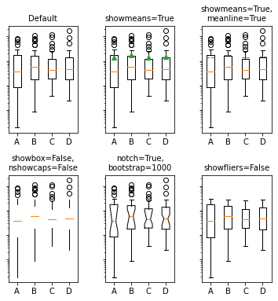


Customizig boxplot using props:


```python
boxprops = dict(linestyle='-', linewidth=2.5, color='red')
flierprops = dict(marker='o', markerfacecolor='red', markersize=12,
                  linestyle='none')
medianprops = dict(linestyle='-.', linewidth=2.5, color='red')
meanpointprops = dict(marker='^', markeredgecolor='black',
                      markerfacecolor='red')
meanlineprops = dict(linestyle='--', linewidth=2.5, color='red')
capprops = dict(linewidth=2.5, color='red')

fig, axes = plt.subplots(nrows=2, ncols=3, figsize=(6, 6), sharey=True)
axes[0, 0].boxplot(data, boxprops=boxprops)
axes[0, 0].set_title('Custom boxprops', fontsize=fs)

axes[0, 1].boxplot(data, flierprops=flierprops, medianprops=medianprops)
axes[0, 1].set_title('Custom medianprops\nand flierprops', fontsize=fs)

axes[0, 2].boxplot(data, capprops=capprops)
axes[0, 2].set_title('Custom capprops', fontsize=fs)

axes[1, 0].boxplot(data, meanprops=meanpointprops, meanline=False,
                   showmeans=True)
axes[1, 0].set_title('Custom mean\nas point', fontsize=fs)

axes[1, 1].boxplot(data, meanprops=meanlineprops, meanline=True,
                   showmeans=True)
axes[1, 1].set_title('Custom mean\nas line', fontsize=fs)

axes[1, 2].boxplot(data, whis=[15, 85])
axes[1, 2].set_title('whis=[15, 85]\n#percentiles', fontsize=fs)

for ax in axes.flat:
    ax.set_yscale('log')
    ax.set_yticklabels([])

fig.subplots_adjust(hspace=0.4, wspace=0.4)

plt.show()
```


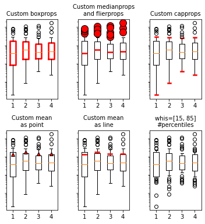


Another way to customise boxplot is using `for` loop on each `boxplot.[<property_name>]`


```python
# Random test data
np.random.seed(19680801)
all_data = [np.random.normal(0, std, size=100) for std in range(1, 4)]
labels = ['x1', 'x2', 'x3']

# Creating figure and axes
fig, ax= plt.subplots(nrows=1, ncols=1, figsize=(6, 4))

# Adding title and label
ax.set(title="Box plot of Student's Percentage",
      xlabel='Class', ylabel='Percentage')

# notch shape box plot on horizontal axis
bplot = ax.boxplot(all_data,  vert=False, notch=True, patch_artist=True, bootstrap=1000)

# fill with colors
colors = ['pink', 'lightblue', 'lightgreen']
for patch, color in zip(bplot['boxes'], colors):
    patch.set_facecolor(color)
    
# changing color and linewidth of medians 
for median in bplot['medians']: 
    median.set(color ='red', 
               linewidth = 3)
    
# changing color and linewidth of whiskers 
for whisker in bplot['whiskers']: 
    whisker.set(color ='#6c3376', 
                linewidth = 1.5, 
                linestyle =":") 

# changing style of fliers 
for flier in bplot['fliers']: 
    flier.set(marker ='^', 
              color ='#e7298a', 
              alpha = 0.5)

# changing style of caps 
for cap in bplot['caps']:
    cap.set(color ='#6c3376',
           linewidth = 1.5)

plt.show()
```


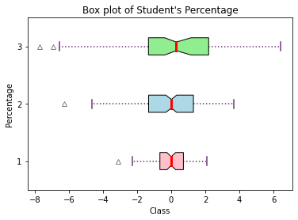


------------------

### E. Matplotlib Styles

You can view various styles available in pyplot using `pyplot.style.available`

*Syntax:*
```python
print(plt.style.available)
```

A specific style can be invoked with either of the two expressions:
```python
plt.style.use('ggplot')
```
or 

```python
plt.style.context('ggplot')
```

Using the later expression with a keyword `with` is recommended:
```python
with plt.style.context('ggplot'):
    # code goes here...
    pass
```

*Example*


```python
with plt.style.context('seaborn-white'):
    fig, ax = plt.subplots(1, 1, figsize=(6,4))
    ax.grid(axis="y", color="grey", linestyle="--", linewidth="1", alpha=0.6)
    ax.set_title("Average daily temperature")
    ax.set_xlabel("Days")
    ax.set_ylabel("Temperature(degrees)")
    ax.plot(days, temp, linestyle="dashed", linewidth=2.5)
    plt.show()
```


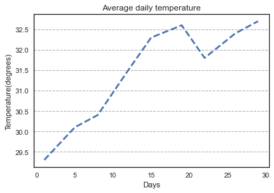


**Creating a Custom Style**
- A style sheet is a text file having extension .mplstyle.
- All custom style sheets are placed in a folder, stylelib, present in the config directory of matplotlib.
- Use the below expression for knowing the Config folder.
```python
import matplotlib
print(matplotlib.get_configdir())
```

Process to create a custom style:
1. Create a file <style_name>.mplstyle and add the style content like:
```python
axes.titlesize : 24
axes.labelsize : 20
lines.linewidth : 8
lines.markersize : 10
xtick.labelsize : 16
ytick.labelsize : 16
```
2. Save it in the folder <matplotlib_configdir/stylelib/.
3. Reload the matplotlib library with:
```python
matplotlib.style.reload_library()
```
4. Now use the custom style with:
```python
with plt.style.context("style_name"):
```

**matplotlibrc file**
- matplotlib uses all the settings specified in matplotlibrc file.
- These settings are known as rc settings or rc parameters.
- For customization, rc settings can be altered in the file or interactively.
- The location of active matplotlibrc file used by matplotlib can be found with below expression.

```python
import matplotlib
matplotlib.matplotlib_fname()
```

**Matplotlib rcParams**
- All rc settings, present in matplotlibrc file are stored in a dictionary named matplotlib.rcParams.
- Any settings can be changed by editing values of this dictionary.
*Example:*
```python
import matplotlib as mpl
mpl.rcParams['lines.linewidth'] = 2
mpl.rcParams['lines.color'] = 'r'
```


-------------

### E. Subplots and Grid

**Subplot**

Creating a subplot will delete any pre-existing subplot that overlaps with it beyond sharing a boundary. If you do not want this behavior, use the Figure.add_subplot method or the pyplot.axes function instead.

*Syntax:*
```python
subplot(nrows, ncols, index, **kwargs)
```

*Example:*


```python
axes1 = plt.subplot(2, 2, (1,3), title='Plot1')
axes2 = plt.subplot(2, 2, 2, title='Plot2')
axes3 = plt.subplot(2, 2, 4, title='Plot3')
plt.show()
```


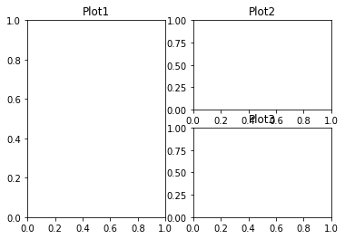


**Grid**

The matplotlib.gridspec.GridSpec class is used to specify the geometry of the grid to place a subplot.

*Syntax:*
```python
gridspec.GridSpec(nrows, ncols, figure=None, left=None, bottom=None, right=None, top=None, wspace=None, hspace=None, width_ratios=None, height_ratios=None)
```

*Params:*

|Params|Details|
|------|-------|
|nrows| It is an integer representing the number of rows in the grid|
|ncols| It is an integer representing the number of columns in the grid|
|figure| It is an optional parameter used to draw figures|
|left, right, top, bottom| These are optional parameters used to define the extent of the subplots as fraction of figure width or height|
|wspase| It is an optional float argument used to reserve the width space between subplots|
|hspace| It is an optional float argument used to reserve the height space between subplots|
|width_ratios| It is an optional parameter that represents the width ratios of the columns|
|height_ratios| It is an optional parameter that represents the width ratios of the rows|

*Example:*


```python
import matplotlib.gridspec as gridspec
fig = plt.figure()
gs = gridspec.GridSpec(3, 3)
ax1 = plt.subplot(gs[:2, :2])
ax2 = plt.subplot(gs[0, 2])
ax3 = plt.subplot(gs[1, 2])
ax4 = plt.subplot(gs[-1, 0])
ax5 = plt.subplot(gs[-1, 1:])
plt.show()
```


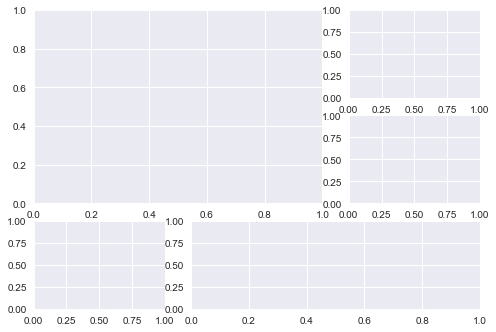

